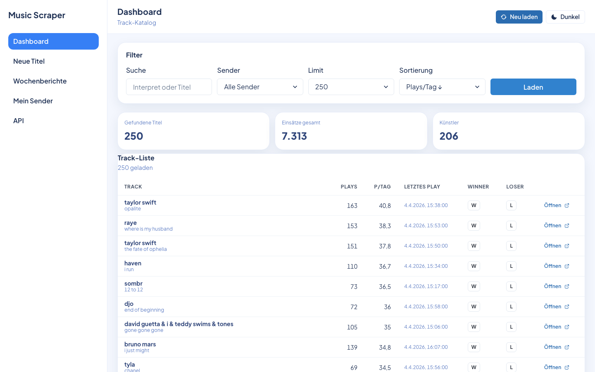
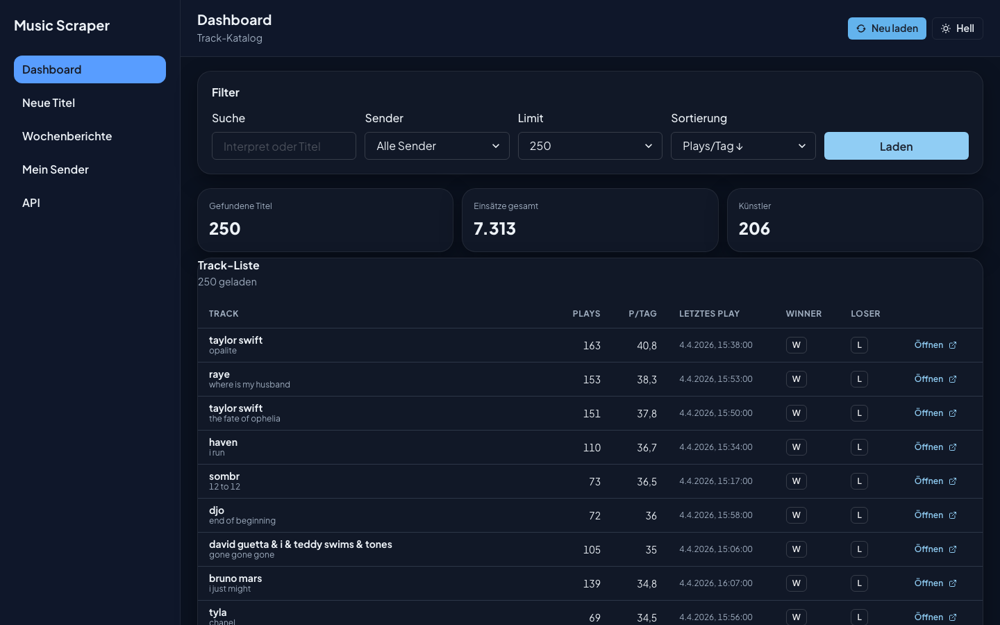
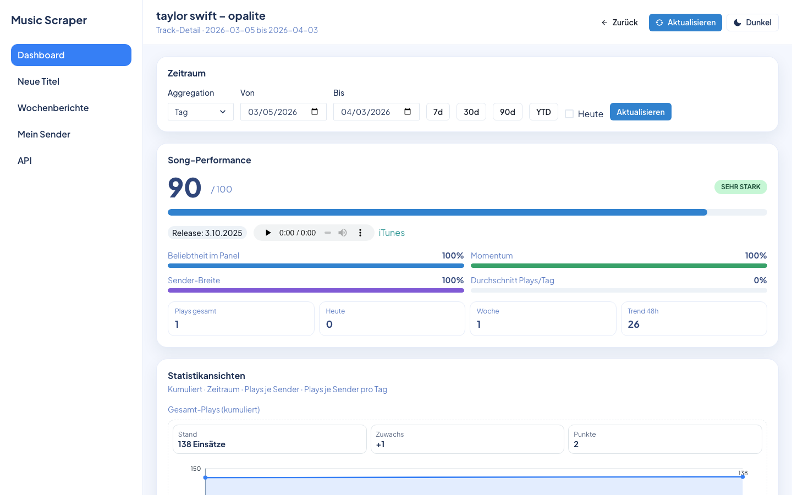
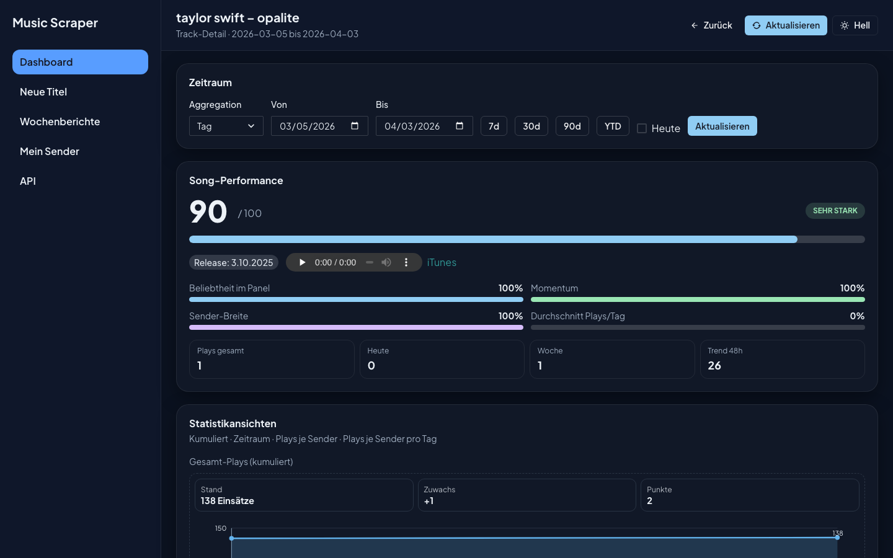
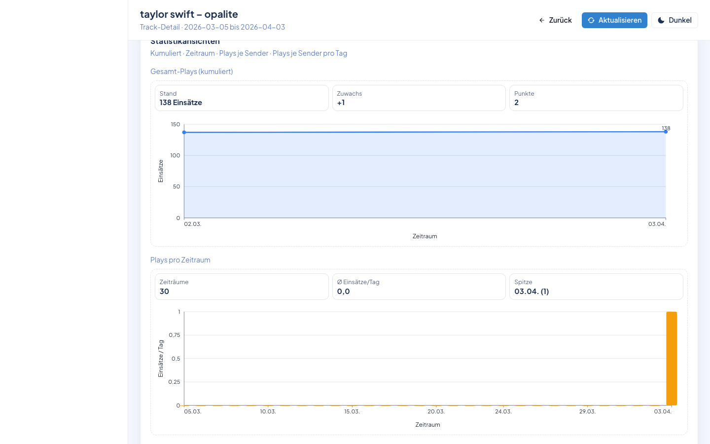
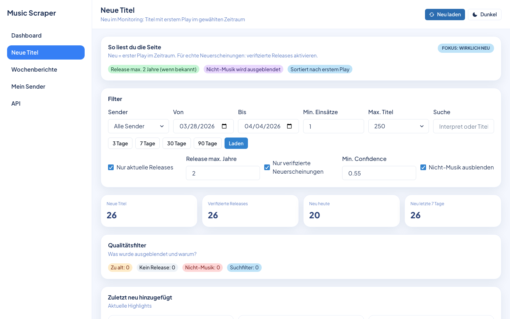
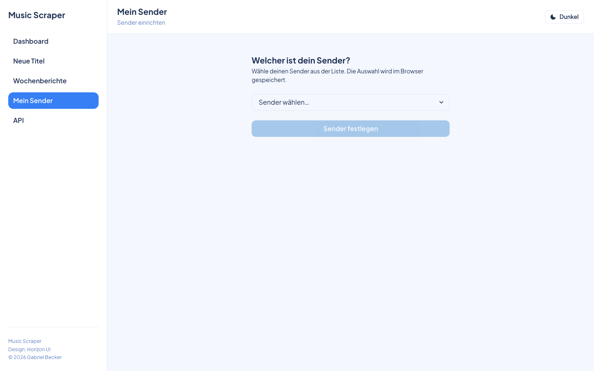
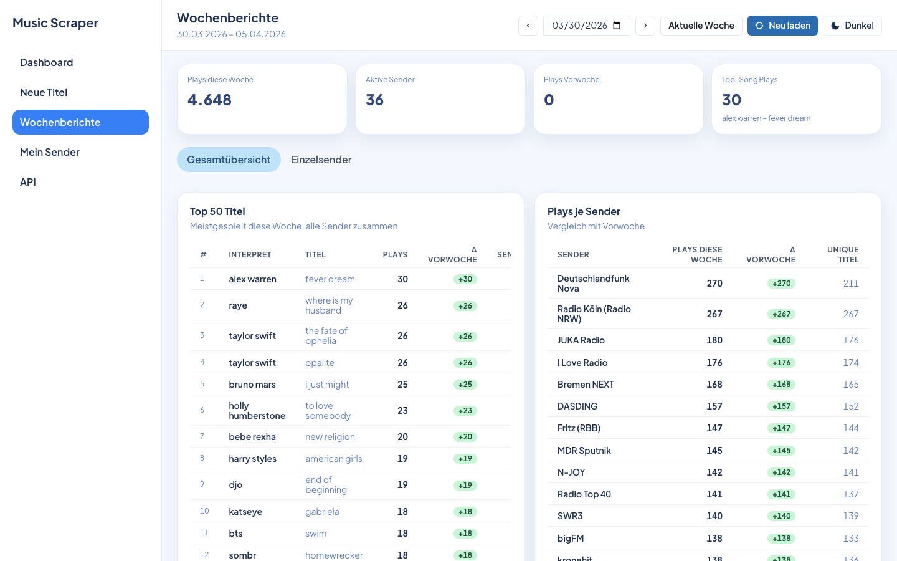
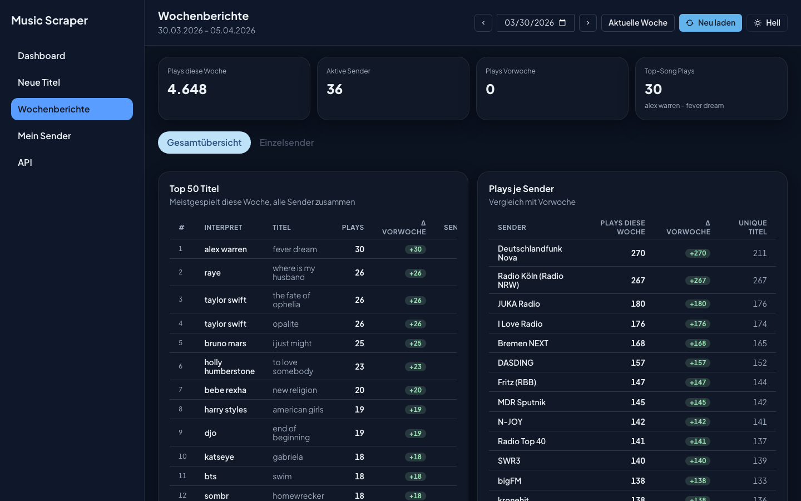

# Music Scraper

**Radio-Analyse-Tool für Sender, die wissen wollen, was gerade läuft.**

> Entstanden durch Vibecoding — entwickelt mit Claude als KI-Partner. Die Ideen und Anforderungen kamen von einem Radiosender, den Code hat Claude geschrieben.

---

## Was ist Music Scraper?

Music Scraper sammelt Playlisten von Radiosendern automatisch ein, normalisiert sie und wertet sie aus. Es richtet sich an **Radiosender**, **Musikredakteure** und alle, die verstehen wollen, was im Radio gerade gespielt wird.

| Anwendungsfall | Beschreibung |
|---|---|
| **Airplay-Analyse** | Wie oft läuft ein Song bei welchem Sender? Wann war der Peak? |
| **Trend-Erkennung** | Welche Songs gewinnen gerade an Rotation? Was verliert? |
| **Exklusiv-Tracks** | Welche Songs spielt nur dein Sender — und sonst niemand? |
| **Verpasste Songs** | Was läuft bei anderen Sendern oft, aber bei dir noch gar nicht? |
| **Mein Sender** | Vergleich deines eigenen Senders mit dem gesamten Markt |
| **Neue Titel** | Welche Songs sind diese Woche neu ins Radio gekommen? |
| **Wochenberichte** | Automatisch generierte Berichte mit Top-Tracks und Bewegungen |

---

## Screenshots

### Dashboard — Track-Katalog

Durchsuchbare, sortierbare Liste aller Tracks mit Plays, Plays/Tag und Last-Seen. Die Kennzahlen (Gefundene Titel, Einsätze, Künstler) stehen direkt über der Tabelle. Per Klick auf „Öffnen" gelangt man zur Song-Detail-Seite. Winner/Loser-Buttons für schnelles Track-Merging direkt in der Tabelle.





---

### Song-Detail — Performance & Analyse

Jeder Track hat eine eigene Seite mit Score (0–100), Momentum, Sender-Breite und allen Plays-Metriken.





Weiter unten: Kumulierter Verlauf, Plays pro Zeitraum und Sender-Vergleich als Balkendiagramme.



---

### Neue Titel

Alle Songs, die in einem bestimmten Zeitraum zum ersten Mal gespielt wurden — filterbar nach Sender, Release-Datum, Einsatzhäufigkeit und Qualitäts-Score.



---

### Mein Sender

Wähle deinen Sender aus und vergleiche ihn mit dem Rest des Markts. Zeigt verpasste Tracks, Geheimtipps und Sender-spezifische Rotation.



---

### Wochenberichte

Automatisch generierte Übersichten mit Top-Tracks, Neueinsteigern, Absteigern und Sender-Vergleich — für jede abgelaufene Woche abrufbar.





---

## Schnellstart

### Voraussetzungen

- Node.js 20+
- npm

```bash
node -v   # sollte 20+ zeigen
npm -v
```

### Installation

```bash
git clone https://github.com/dergabriel/music-scraper.git
cd music-scraper
npm install
```

### Konfiguration

Kopiere die Beispielkonfiguration und passe sie an:

```bash
cp config.yaml.example config.yaml
```

Mindestens einen Sender in `config.yaml` eintragen — siehe [Sender hinzufügen](docs/add-station.md).

### Starten

```bash
node src/cli.js api --config config.yaml --db music-scraper.sqlite --port 8787
```

Der Server startet auf Port `8787`. Beim ersten Start werden automatisch die Playlisten der konfigurierten Sender eingesammelt.

### Seiten

| Seite | Pfad |
|---|---|
| Dashboard | `/dashboard` |
| Neue Titel | `/new-titles` |
| Mein Sender | `/my-station` |
| Wochenberichte | `/weekly-reports` |
| API Docs | `/api/docs` |

> Der interne Cron läuft stündlich automatisch — kein externer Cronjob nötig.

---

## Dokumentation

- [Setup & Installation](docs/setup.md) — Schritt-für-Schritt-Einrichtung
- [Neuen Sender hinzufügen](docs/add-station.md) — Sender konfigurieren

---

## Funktionsübersicht

### Dashboard
Überblick über alle gesammelten Tracks mit Plays, Plays/Tag und letztem Einsatz. Filter nach Sender, Sortierung nach verschiedenen Metriken. Winner/Loser-Buttons für schnelles Merging von Duplikaten direkt in der Tabelle.

### Song-Detail
Jeder Track öffnet eine eigene Seite mit:
- **Score 0–100** aus Beliebtheit, Momentum, Sender-Breite und Plays/Tag
- Kumulierter Verlauf, Plays pro Zeitraum, Sender-Vergleich
- Rohdaten vs. panelbereinigter Trend
- Zeitraum frei wählbar (7d / 30d / 90d / YTD / custom)

### Neue Titel
Alle Songs, die in einem bestimmten Zeitraum erstmals gespielt wurden — filterbar nach Sender, Release-Datum, Min/Max-Einsätze und Qualitätsscore.

### Mein Sender
Das Kernstück für Redakteure: Wähle deinen eigenen Sender und vergleiche ihn direkt mit dem Rest.
- **Verpasste Tracks** — Songs die andere Sender oft spielen, dein Sender aber nicht
- **Geheimtipps** — Songs die (fast) nur dein Sender spielt
- Sender-Auswahl wird im Browser gespeichert

### Wochenberichte
Automatisch generierte Berichte mit Top-Tracks, Neueinsteigern und Absteigern — für jede abgelaufene Woche abrufbar.

---

## Technologie

- **Backend**: Node.js, Express, SQLite (better-sqlite3)
- **Frontend**: Vanilla JS, React (via CDN), Chakra UI
- **Datensammlung**: HTTP-Fetcher + Playwright für JS-gerenderte Seiten
- **Parser**: onlineradiobox, DLF Nova, laut.fm JSON, NRW Lokalradios, generisches HTML

---

## Lizenz

MIT
